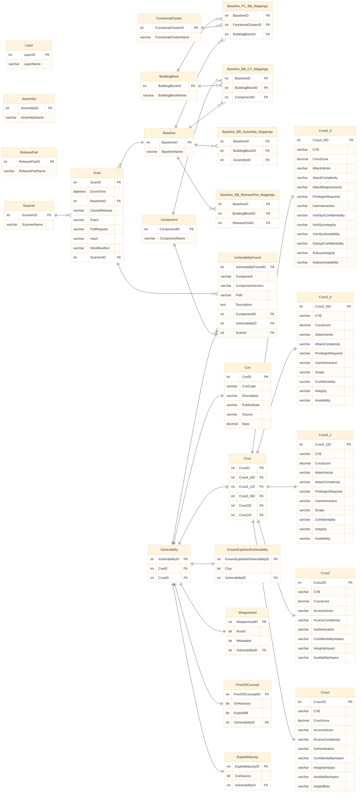

# Diagram-Vuln
# Vulnerability Management — Database Schema

```mermaid
%%{init: {'theme': 'base', 'themeVariables': {'fontSize': '18px'}, 'er': {'entityPadding': 20, 'minEntityWidth': 150}}}%%
erDiagram
  direction LR

  Baseline {
    int BaselineID PK
    varchar BaselineName
  }
  FunctionalCluster {
    int FunctionalClusterID PK
    varchar FunctionalClusterName
  }
  BuildingBlock {
    int BuildingBlockID PK
    varchar BuildingBlockName
  }
  Component {
    int ComponentID PK
    varchar ComponentName
  }
  Layer {
    int LayerID PK
    varchar LayerName
  }
  Assembly {
    int AssemblyID PK
    varchar AssemblyName
  }
  ReleasePart {
    int ReleasePartID PK
    varchar ReleasePartName
  }
  Baseline_FC_BB_Mappings {
    int BaselineID FK
    int FunctionalClusterID FK
    int BuildingBlockID FK
  }
  Baseline_BB_CC_Mappings {
    int BaselineID FK
    int BuildingBlockID FK
    int ComponentID FK
  }
  Baseline_BB_Assembly_Mappings {
    int BaselineID FK
    int BuildingBlockID FK
    int AssemblyID FK
  }
  Baseline_BB_ReleasePart_Mappings {
    int BaselineID FK
    int BuildingBlockID FK
    int ReleasePartID FK
  }
  Scanner {
    int ScannerID PK
    varchar ScannerName
  }
  Scan {
    int ScanID PK
    datetime EventTime
    int BaselineID FK
    varchar ClosedRelease
    varchar Patch
    varchar PullRequest
    varchar Hash
    varchar WorkflowRun
    int ScannerID FK
  }
  VulnerabilityFound {
    int VulnerabilityFoundID PK
    varchar Component
    varchar ComponentVersion
    varchar Path
    text Description
    int ComponentID FK
    int VulnerabilityID FK
    int ScanID FK
  }
  Vulnerability {
    int VulnerabilityID PK
    int CveID FK
    int CvssID FK
  }
  Cve {
    int CveID PK
    varchar CveCode
    varchar Description
    varchar PublishDate
    varchar Source
    decimal Epss
  }
  Cvss {
    int CvssID PK
    int Cvss4_0ID FK
    int Cvss3_1ID FK
    int Cvss3_0ID FK
    int Cvss2ID FK
    int Cvss1ID FK
  }
  Cvss4_0 {
    int Cvss4_0ID PK
    varchar CVE
    decimal CvssScore
    varchar AttackVector
    varchar AttackComplexity
    varchar AttackRequirements
    varchar PrivilegesRequired
    varchar UserInteraction
    varchar VulnSysConfidentiality
    varchar VulnSysIntegrity
    varchar VulnSysAvailability
    varchar SubsysConfidentiality
    varchar SubsysIntegrity
    varchar SubsysAvailability
  }
  Cvss3_1 {
    int Cvss3_1ID PK
    varchar CVE
    decimal CvssScore
    varchar AttackVector
    varchar AttackComplexity
    varchar PrivilegesRequired
    varchar UserInteraction
    varchar Scope
    varchar Confidentiality
    varchar Integrity
    varchar Availability
  }
  Cvss3_0 {
    int Cvss3_0ID PK
    varchar CVE
    decimal CvssScore
    varchar AttackVector
    varchar AttackComplexity
    varchar PrivilegesRequired
    varchar UserInteraction
    varchar Scope
    varchar Confidentiality
    varchar Integrity
    varchar Availability
  }
  Cvss2 {
    int Cvss2ID PK
    varchar CVE
    decimal CvssScore
    varchar AccessVector
    varchar AccessComplexity
    varchar Authentication
    varchar ConfidentialityImpact
    varchar IntegrityImpact
    varchar AvailabilityImpact
  }
  Cvss1 {
    int Cvss1ID PK
    varchar CVE
    decimal CvssScore
    varchar AccessVector
    varchar AccessComplexity
    varchar Authentication
    varchar ConfidentialityImpact
    varchar IntegrityImpact
    varchar AvailabilityImpact
    varchar ImpactBias
  }
  KnownExploitedVulnerability {
    int KnownExploitedVulnerabilityID PK
    bit Cisa
    int VulnerabilityID FK
  }
  Weaponized {
    int WeaponizedID PK
    bit Nuclei
    bit Metasploit
    int VulnerabilityID FK
  }
  ProofOfConcept {
    int ProofOfConceptID PK
    bit GhAdvisory
    bit ExploitDB
    int VulnerabilityID FK
  }
  ExploitMaturity {
    int ExploitMaturityID PK
    bit CveSource
    int VulnerabilityID FK
  }

  Baseline ||--o{ Baseline_FC_BB_Mappings : " "
  FunctionalCluster ||--o{ Baseline_FC_BB_Mappings : " "
  BuildingBlock ||--o{ Baseline_FC_BB_Mappings : " "
  Baseline ||--o{ Baseline_BB_CC_Mappings : " "
  Baseline ||--o{ Baseline_BB_ReleasePart_Mappings : " "
  Baseline ||--o{ Baseline_BB_Assembly_Mappings : " "
  BuildingBlock ||--o{ Baseline_BB_CC_Mappings : " "
  Component ||--o{ Baseline_BB_CC_Mappings : " "
  Vulnerability ||--|{ VulnerabilityFound : " "
  Vulnerability ||--|| KnownExploitedVulnerability : " "
  Vulnerability ||--|| Weaponized : " "
  Vulnerability ||--|| ExploitMaturity : " "
  Vulnerability ||--|| Cve : " "
  Vulnerability ||--|| ProofOfConcept : " "
  Component ||--o{ VulnerabilityFound : " "
  Scan ||--o{ VulnerabilityFound : " "
  Scanner ||--|{ Scan : " "
  Vulnerability ||--|| Cvss : " "
  Cvss ||--|| Cvss4_0 : " "
  Cvss ||--|| Cvss3_0 : " "
  Cvss ||--|| Cvss3_1 : " "
  Cvss ||--|| Cvss2 : " "
  Cvss ||--|| Cvss1 : " "
  Scan }|--|| Baseline : " "
```
